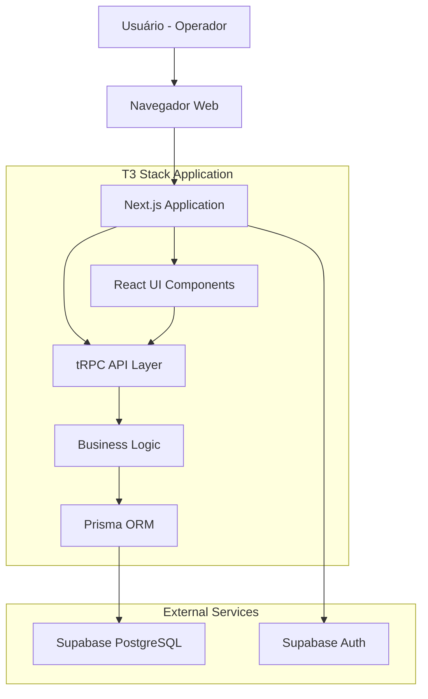

# Design - Sistema de Análise Logística

## Overview

O Sistema de Análise Logística será desenvolvido como uma aplicação web full-stack utilizando o T3 Stack, proporcionando uma solução moderna, type-safe e eficiente para substituir o processo manual de controle de KPIs logísticos. A arquitetura monolítica com Next.js oferecerá uma experiência integrada entre frontend e backend, enquanto o tRPC garantirá comunicação type-safe e o Prisma facilitará o acesso aos dados.

O design prioriza simplicidade, performance e usabilidade, focando na redução do tempo de entrada de dados em pelo menos 50% comparado ao processo atual com planilhas.

## Architecture

### Arquitetura de Alto Nível



### Stack Tecnológico (Baseado no Template Existente)

- **Framework**: Next.js 15.2.3 (App Router) ✅ Já configurado
- **Linguagem**: TypeScript 5.8.2 ✅ Já configurado
- **UI Library**: React 19.0.0 ✅ Já configurado
- **API Layer**: tRPC 11.0.0 ✅ Já configurado
- **ORM**: Prisma 6.5.0 ✅ Já configurado
- **Database**: PostgreSQL (via DATABASE_URL) ✅ Configurado
- **Styling**: Tailwind CSS 4.0.15 ✅ Já configurado
- **Validation**: Zod 3.24.2 ✅ Já configurado
- **Query Client**: TanStack React Query 5.69.0 ✅ Já configurado
- **Transformer**: SuperJSON 2.2.1 ✅ Já configurado

**Adições Necessárias:**
- **Authentication**: Supabase Auth v2 (a ser adicionado)
- **UI Components**: Shadcn/ui (a ser adicionado)
- **Containerization**: Docker (a ser adicionado)

### Padrões Arquiteturais

1. **Full-stack Monolítico**: Frontend e backend na mesma aplicação Next.js
2. **Type-safe API**: tRPC garante tipagem end-to-end
3. **Schema-first Database**: Prisma como fonte única da verdade
4. **Component-based UI**: React com componentes Shadcn/ui reutilizáveis
5. **Server-side Rendering**: Next.js para performance otimizada

## Components and Interfaces

### Componentes Principais

#### 1. Authentication System
- **LoginForm**: Formulário de autenticação com validação
- **AuthProvider**: Context provider para estado de autenticação
- **ProtectedRoute**: HOC para proteção de rotas

#### 2. Client Management
- **ClientList**: Tabela de listagem de clientes
- **ClientForm**: Formulário para CRUD de clientes
- **ClientModal**: Modal para adicionar/editar clientes

#### 3. KPI Entry System
- **DateSelector**: Componente para seleção de data
- **KpiEntryTable**: Tabela principal para entrada de dados
- **KpiEntryCell**: Célula editável para valores de KPI
- **SaveButton**: Botão para persistir dados
 - **Edição Avançada**: Detecção de alterações por célula, desfazer (por célula e global), exclusão individual com confirmação, ícones sobrepostos aos campos e inputs numéricos sem spinners

#### 4. Layout Components
- **DashboardLayout**: Layout principal da aplicação
- **Navigation**: Menu lateral de navegação
- **Header**: Cabeçalho com informações do usuário

### Interfaces de Dados

```typescript
// User Interface (Supabase Auth)
interface User {
  id: string;
  email: string;
  created_at: string;
}

// Client Interface
interface Client {
  id: string;
  name: string;
  status: 'ATIVO' | 'INATIVO';
  createdAt: Date;
  updatedAt: Date;
}

// KPI Entry Interface
interface KpiEntry {
  id: string;
  date: Date;
  clientId: string;
  kpiType: KpiType;
  kpiValue: number;
  createdAt: Date;
  updatedAt: Date;
  client: Client;
}

// KPI Types
type KpiType = 'RECEITA' | 'ON_TIME' | 'OCUPACAO' | 'TERCEIRO' | 'DISPONIBILIDADE';

// Form Data Interfaces
interface KpiEntryFormData {
  date: string;
  entries: {
    clientId: string;
    receita?: number;
    onTime?: number;
    ocupacao?: number;
    terceiro?: number;
    disponibilidade?: number;
  }[];
}
```

### tRPC API Structure

**Estado Atual:** O template possui um `postRouter` de exemplo que será substituído pelos roteadores do sistema.

```typescript
// src/server/api/routers/auth.ts (a ser criado)
const authRouter = createTRPCRouter({
  getSession: publicProcedure.query(({ ctx }) => ctx.session),
});

// src/server/api/routers/client.ts (a ser criado)
const clientRouter = createTRPCRouter({
  getAll: protectedProcedure.query(async ({ ctx }) => { /* ... */ }),
  create: protectedProcedure
    .input(createClientSchema)
    .mutation(async ({ ctx, input }) => { /* ... */ }),
  update: protectedProcedure
    .input(updateClientSchema)
    .mutation(async ({ ctx, input }) => { /* ... */ }),
  delete: protectedProcedure
    .input(z.object({ id: z.string() }))
    .mutation(async ({ ctx, input }) => { /* ... */ }),
});

// src/server/api/routers/kpiEntry.ts (a ser criado)
const kpiEntryRouter = createTRPCRouter({
  getByDate: protectedProcedure
    .input(z.object({ date: z.string() }))
    .query(async ({ ctx, input }) => { /* ... */ }),
  upsertMany: protectedProcedure
    .input(upsertKpiEntriesSchema)
    .mutation(async ({ ctx, input }) => { /* ... */ }),
  deleteEntry: protectedProcedure
    .input(z.object({ id: z.string() }))
    .mutation(async ({ ctx, input }) => { /* ... */ }),
});

// src/server/api/root.ts (a ser atualizado)
export const appRouter = createTRPCRouter({
  auth: authRouter,
  client: clientRouter,
  kpiEntry: kpiEntryRouter,
});
```

## Data Models

### Database Schema (Prisma)

**Estado Atual:** O template possui um modelo `Post` de exemplo que será substituído pelos modelos do sistema.

```prisma
// prisma/schema.prisma (a ser atualizado)
generator client {
  provider = "prisma-client-js"
}

datasource db {
  provider = "postgresql"
  url      = env("DATABASE_URL")
}

model Client {
  id        String     @id @default(uuid())
  name      String     @unique
  status    ClientStatus @default(ATIVO)
  createdAt DateTime   @default(now())
  updatedAt DateTime   @updatedAt
  entries   KpiEntry[]

  @@map("clients")
}

model KpiEntry {
  id        String   @id @default(uuid())
  date      DateTime @db.Date
  kpiType   KpiType
  kpiValue  Decimal  @db.Decimal(10, 2)
  createdAt DateTime @default(now())
  updatedAt DateTime @updatedAt
  clientId  String
  client    Client   @relation(fields: [clientId], references: [id], onDelete: Cascade)

  @@unique([date, clientId, kpiType])
  @@map("kpi_entries")
}

enum ClientStatus {
  ATIVO
  INATIVO
}

enum KpiType {
  RECEITA
  ON_TIME
  OCUPACAO
  TERCEIRO
  DISPONIBILIDADE
}
```

### Relacionamentos

1. **Client → KpiEntry**: Um cliente pode ter múltiplas entradas de KPI (1:N)
2. **Date + Client + KpiType**: Combinação única para evitar duplicatas
3. **Cascade Delete**: Remoção de cliente remove todas as entradas relacionadas

### Validação de Dados

```typescript
// Zod Schemas para Validação
const createClientSchema = z.object({
  name: z.string().min(1, "Nome é obrigatório").max(100, "Nome muito longo"),
  status: z.enum(['ATIVO', 'INATIVO']).default('ATIVO'),
});

const kpiValueSchema = z.object({
  receita: z.number().min(0, "Receita deve ser positiva").optional(),
  onTime: z.number().min(0).max(100, "Percentual deve estar entre 0 e 100").optional(),
  ocupacao: z.number().min(0).max(100, "Percentual deve estar entre 0 e 100").optional(),
  terceiro: z.number().min(0).max(100, "Percentual deve estar entre 0 e 100").optional(),
  disponibilidade: z.number().min(0).max(100, "Percentual deve estar entre 0 e 100").optional(),
});

const upsertKpiEntriesSchema = z.object({
  date: z.string().regex(/^\d{4}-\d{2}-\d{2}$/, "Data deve estar no formato YYYY-MM-DD"),
  entries: z.array(z.object({
    clientId: z.string().uuid(),
    kpiType: z.enum(['RECEITA', 'ON_TIME', 'OCUPACAO', 'TERCEIRO', 'DISPONIBILIDADE']),
    kpiValue: z.number(),
  })),
});
```

## Error Handling

### Estratégia de Tratamento de Erros

#### 1. Client-side Error Handling
```typescript
// Error Boundary para capturar erros React
class ErrorBoundary extends React.Component {
  constructor(props) {
    super(props);
    this.state = { hasError: false };
  }

  static getDerivedStateFromError(error) {
    return { hasError: true };
  }

  componentDidCatch(error, errorInfo) {
    console.error('Error caught by boundary:', error, errorInfo);
  }

  render() {
    if (this.state.hasError) {
      return <ErrorFallback />;
    }
    return this.props.children;
  }
}

// Hook para tratamento de erros tRPC
const useErrorHandler = () => {
  const showToast = useToast();
  
  return (error: unknown) => {
    if (error instanceof TRPCError) {
      showToast({
        title: "Erro",
        description: error.message,
        variant: "destructive",
      });
    } else {
      showToast({
        title: "Erro inesperado",
        description: "Tente novamente em alguns instantes",
        variant: "destructive",
      });
    }
  };
};
```

#### 2. Server-side Error Handling
```typescript
// Custom tRPC Error Handler
const createTRPCContext = async ({ req, res }: CreateNextContextOptions) => {
  const session = await getServerAuthSession({ req, res });
  
  return {
    session,
    prisma,
  };
};

// Error Middleware
const errorMiddleware = t.middleware(async ({ next }) => {
  try {
    return await next();
  } catch (error) {
    if (error instanceof Prisma.PrismaClientKnownRequestError) {
      if (error.code === 'P2002') {
        throw new TRPCError({
          code: 'CONFLICT',
          message: 'Registro já existe para esta data e cliente',
        });
      }
    }
    
    console.error('Unexpected error:', error);
    throw new TRPCError({
      code: 'INTERNAL_SERVER_ERROR',
      message: 'Erro interno do servidor',
    });
  }
});
```

#### 3. Tipos de Erro e Tratamento

| Tipo de Erro | Código HTTP | Tratamento |
|---------------|-------------|------------|
| Validação de dados | 400 | Destacar campos inválidos |
| Não autenticado | 401 | Redirecionar para login |
| Não autorizado | 403 | Exibir mensagem de acesso negado |
| Registro não encontrado | 404 | Exibir mensagem amigável |
| Conflito de dados | 409 | Sugerir ação alternativa |
| Erro de servidor | 500 | Exibir mensagem genérica |

## Testing Strategy

### Estratégia de Testes para MVP

#### 1. Testes de Unidade
- **Componentes React**: Testing Library + Jest
- **Funções utilitárias**: Jest
- **Validação Zod**: Jest
- **tRPC procedures**: Jest + Prisma mock

#### 2. Testes de Integração
- **API endpoints**: Supertest + Test database
- **Database operations**: Prisma + Test database
- **Authentication flow**: Supabase test client

#### 3. Testes E2E (Futuro)
- **Playwright** para fluxos críticos
- **Cypress** como alternativa

### Estrutura de Testes

```
src/
├── __tests__/
│   ├── components/
│   │   ├── KpiEntryTable.test.tsx
│   │   ├── ClientForm.test.tsx
│   │   └── DateSelector.test.tsx
│   ├── server/
│   │   ├── routers/
│   │   │   ├── client.test.ts
│   │   │   └── kpiEntry.test.ts
│   │   └── utils/
│   └── utils/
│       ├── validation.test.ts
│       └── formatting.test.ts
```

### Configuração de Teste

```typescript
// jest.config.js
module.exports = {
  testEnvironment: 'jsdom',
  setupFilesAfterEnv: ['<rootDir>/src/test/setup.ts'],
  moduleNameMapping: {
    '^@/(.*)$': '<rootDir>/src/$1',
  },
  collectCoverageFrom: [
    'src/**/*.{ts,tsx}',
    '!src/**/*.d.ts',
    '!src/test/**/*',
  ],
  coverageThreshold: {
    global: {
      branches: 70,
      functions: 70,
      lines: 70,
      statements: 70,
    },
  },
};

// src/test/setup.ts
import '@testing-library/jest-dom';
import { server } from './mocks/server';

beforeAll(() => server.listen());
afterEach(() => server.resetHandlers());
afterAll(() => server.close());
```

## UI/UX Design Patterns

### Design System

#### 1. Componentes Base (Shadcn/ui)
- **Button**: Ações primárias e secundárias
- **Input**: Campos de entrada de dados
- **Table**: Exibição de dados tabulares
- **Modal/Dialog**: Formulários e confirmações
- **Toast**: Notificações e feedback
- **DatePicker**: Seleção de datas
- **Select**: Dropdowns e seleções

#### 2. Layout Patterns
```typescript
// Dashboard Layout
const DashboardLayout = ({ children }: { children: React.ReactNode }) => (
  <div className="flex h-screen bg-gray-50">
    <Sidebar />
    <main className="flex-1 overflow-auto">
      <Header />
      <div className="p-6">
        {children}
      </div>
    </main>
  </div>
);

// KPI Entry Table Pattern
const KpiEntryTable = ({ date, clients, entries, onSave }) => (
  <div className="space-y-4">
    <div className="flex justify-between items-center">
      <DateSelector value={date} onChange={setDate} />
      <Button onClick={onSave} disabled={!hasChanges}>
        Salvar Dados
      </Button>
    </div>
    
    <Table>
      <TableHeader>
        <TableRow>
          <TableHead>Cliente</TableHead>
          <TableHead>Receita (R$)</TableHead>
          <TableHead>On Time (%)</TableHead>
          <TableHead>Ocupação (%)</TableHead>
          <TableHead>Terceiro (%)</TableHead>
          <TableHead>Disponibilidade (%)</TableHead>
        </TableRow>
      </TableHeader>
      <TableBody>
        {clients.map(client => (
          <KpiEntryRow key={client.id} client={client} entries={entries} />
        ))}
      </TableBody>
    </Table>
  </div>
);
```

#### 3. Estados de Interface
- **Loading**: Skeleton loaders para carregamento
- **Empty**: Estados vazios com call-to-action
- **Error**: Mensagens de erro com ações de recuperação
- **Success**: Confirmações visuais de ações bem-sucedidas

### Responsividade

```css
/* Tailwind CSS Classes para Responsividade */
.kpi-table {
  @apply w-full overflow-x-auto;
}

.kpi-table-container {
  @apply min-w-full md:min-w-0;
}

.mobile-kpi-card {
  @apply block md:hidden space-y-2 p-4 border rounded-lg;
}

.desktop-kpi-table {
  @apply hidden md:table;
}
```

## Performance Considerations

### Otimizações de Performance

#### 1. Frontend Optimizations
- **React.memo**: Componentes que não mudam frequentemente
- **useMemo/useCallback**: Cálculos e funções custosas
- **Lazy Loading**: Componentes não críticos
- **Virtual Scrolling**: Para listas grandes de clientes

#### 2. Backend Optimizations
- **Database Indexing**: Índices em campos de busca frequente
- **Query Optimization**: Select apenas campos necessários
- **Connection Pooling**: Prisma connection pooling
- **Caching**: Redis para dados frequentemente acessados (futuro)

#### 3. Network Optimizations
- **tRPC Batching**: Múltiplas queries em uma requisição
- **Compression**: Gzip/Brotli no servidor
- **CDN**: Para assets estáticos (futuro)

### Métricas de Performance

| Métrica | Target | Medição |
|---------|--------|---------|
| First Contentful Paint | < 1.5s | Lighthouse |
| Largest Contentful Paint | < 2.5s | Lighthouse |
| Time to Interactive | < 3s | Lighthouse |
| API Response Time | < 500ms | Server logs |
| Database Query Time | < 100ms | Prisma logs |

## Security Considerations

### Segurança da Aplicação

#### 1. Authentication & Authorization
- **Supabase Auth**: JWT tokens seguros
- **Session Management**: Refresh tokens automáticos
- **Route Protection**: Middleware de autenticação
- **RBAC**: Role-based access control (futuro)

#### 2. Data Protection
- **Input Validation**: Zod schemas em todas as entradas
- **SQL Injection Prevention**: Prisma ORM
- **XSS Prevention**: React built-in protection
- **CSRF Protection**: Next.js CSRF tokens

#### 3. Infrastructure Security
- **HTTPS**: SSL/TLS obrigatório
- **Environment Variables**: Secrets em .env
- **Docker Security**: Non-root containers
- **VPS Hardening**: Firewall e SSH keys

### Compliance e Auditoria

```typescript
// Audit Log Schema (futuro)
model AuditLog {
  id        String   @id @default(uuid())
  userId    String
  action    String   // CREATE, UPDATE, DELETE
  resource  String   // CLIENT, KPI_ENTRY
  resourceId String?
  oldValues Json?
  newValues Json?
  timestamp DateTime @default(now())
  ipAddress String?
  userAgent String?
}
```

## Deployment Architecture

### Estrutura do Projeto Existente

O template T3 já está configurado com:
- **Estrutura de pastas**: `src/app` (App Router), `src/server`, `src/trpc`
- **Scripts NPM**: `dev`, `build`, `start`, `db:push`, `db:migrate`
- **Configuração TypeScript**: Paths aliases com `~/`
- **Linting**: ESLint + Prettier configurados
- **Variáveis de ambiente**: Validação com Zod em `src/env.js`

### Containerização (a ser adicionada)

```dockerfile
# Dockerfile (a ser criado)
FROM node:18-alpine AS base
WORKDIR /app
COPY package*.json ./
RUN npm ci --only=production

FROM base AS build
COPY . .
RUN npm run build

FROM base AS runtime
COPY --from=build /app/.next ./.next
COPY --from=build /app/public ./public
EXPOSE 3000
CMD ["npm", "start"]
```

### Docker Compose

```yaml
# docker-compose.yml
version: '3.8'
services:
  app:
    build: .
    ports:
      - "3000:3000"
    environment:
      - DATABASE_URL=${DATABASE_URL}
      - NEXTAUTH_SECRET=${NEXTAUTH_SECRET}
      - SUPABASE_URL=${SUPABASE_URL}
      - SUPABASE_ANON_KEY=${SUPABASE_ANON_KEY}
    restart: unless-stopped
    
  nginx:
    image: nginx:alpine
    ports:
      - "80:80"
      - "443:443"
    volumes:
      - ./nginx.conf:/etc/nginx/nginx.conf
      - ./ssl:/etc/ssl
    depends_on:
      - app
    restart: unless-stopped
```

### CI/CD Pipeline

```yaml
# .github/workflows/deploy.yml
name: Deploy to VPS
on:
  push:
    branches: [main]

jobs:
  deploy:
    runs-on: ubuntu-latest
    steps:
      - uses: actions/checkout@v3
      
      - name: Build and push Docker image
        run: |
          docker build -t sistema-logistica:latest .
          
      - name: Deploy to VPS
        uses: appleboy/ssh-action@v0.1.5
        with:
          host: ${{ secrets.VPS_HOST }}
          username: ${{ secrets.VPS_USER }}
          key: ${{ secrets.VPS_SSH_KEY }}
          script: |
            cd /app/sistema-logistica
            git pull origin main
            docker-compose down
            docker-compose up -d --build
```

Este design fornece uma base sólida para o desenvolvimento do Sistema de Análise Logística, seguindo as melhores práticas do T3 Stack e atendendo todos os requisitos funcionais e não-funcionais definidos.